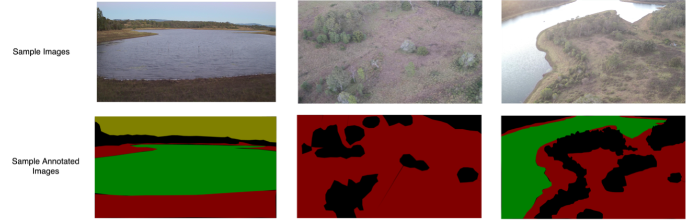

<!-- PROJECT LOGO -->
<br />
<p align="center">
  <a href="https://github.com/othneildrew/Best-README-Template">
	
  </a>

  <h3 align="center">EGH400-2 Project - Wildlife Monitoring Using Machine Learning for Aerial Imagery</h3>

  <h4 align="center">Student: Harry Tran - Queensland University of Technology (QUT)</h4>
</p>


<!-- TABLE OF CONTENTS -->
<details open="open">
  <summary>Table of Contents</summary>
  <ol>
	<li>
	  <a href="#about-the-project">About The Project</a>
	  <ul>
		<li><a href="#built-with">Built With</a></li>
	  </ul>
	</li>
	<li>
	  <a href="#instructions">Instructions</a>
	  <ul>
		<li><a href="#installation">Installation</a></li>
		<li><a href="#usage">Usage</a></li>
	  </ul>
	</li>
	<li><a href="#contact">Contact</a></li>
	<li><a href="#acknowledgements">Acknowledgements</a></li>
  </ol>
</details>

<!-- ABOUT THE PROJECT -->


## About The Project

The project <b>Wildlife Monitoring Using Machine Learning For Aerial Imagery</b> is conducted under the supervision of [Dr. Simon Deman](https://staff.qut.edu.au/staff/s.denman) and includes two phases:

1. Build the scene semantic segmentation to produce the output label map for the input of RGB image, using the dataset of 185 labeled images. - [Link](https://github.com/tranquanghuy0801/drone-segment-bm)

2. Develop a GAN model to generate the labels automatically for the dataset without being labeled.

### Built With

* [TensorFlow](https://www.tensorflow.org/)
* [Keras](https://keras.io/)
* [Numpy](https://numpy.org/)
* [OpenCV](https://opencv.org/)

<!-- GETTING STARTED -->
## Instructions

This is an example of how you may give instructions on setting up your project locally.
To get a local copy up and running follow these simple example steps.

### Installation

This is an example of how to list things you need to use the software and how to install them.

* Create virtual Python environment

  ```sh
  conda create -n <yourenvname> python=3.7 anaconda
  ```

* Install required libraries

  ```sh
  pip install requirements.txt
  ```

### Usage

* Training the pix2pix model (P2)
  
	Change line 297 in file <b>pix2pix.py</b> to <b>gan.dataset_name = "pix2pix" </b>
  ```sh
  python3 pix2pix.py
  ```

* Training the semi-supervised pix2pix model (P2S)


	Change line 297 in file <b>pix2pix.py</b> to <b>gan.dataset_name = "semi-pix2pix" </b>
  ```sh
  python3 pix2pix.py
  ```

* Training the semi-supervised pix2pix model with WGAN (P2S-W)

	Change line 297 in file <b>pix2pix.py</b> to <b>gan.dataset_name = "semi-pix2pix" </b>
	
	Change line 298 in file <b>pix2pix.py</b> to <b>gain.train_wgan = True</b>
  ```sh
  python3 pix2pix.py
  ```
  
## Supervisor

[Dr. Simon Deman](https://staff.qut.edu.au/staff/s.denman) - Science & Engineering Faculty - QUT

<!-- CONTACT -->
## Contact

Harry Tran - huytran.quang080199@gmail.com

Project Link: [https://github.com/tranquanghuy0801/scene-segmentation](https://github.com/tranquanghuy0801/scene-segmentation)

<!-- ACKNOWLEDGEMENTS -->
## Acknowledgements
* [Keras-GAN](https://github.com/eriklindernoren/Keras-GAN)
* [QUT High Performance Computing and Research Support (HPC)](https://cms.qut.edu.au/__data/assets/pdf_file/0012/388785/high-performance-computing.pdf)
